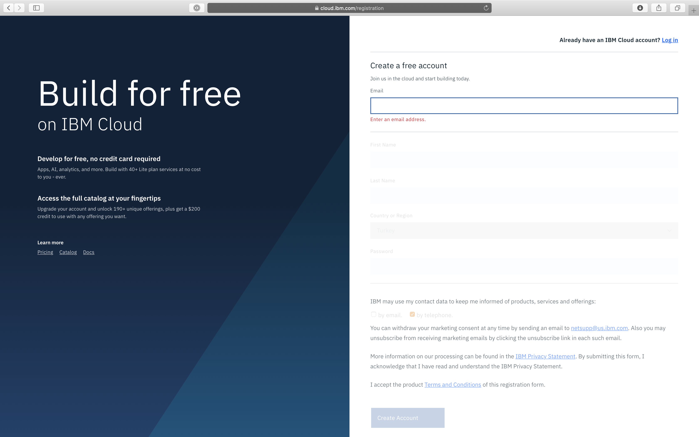
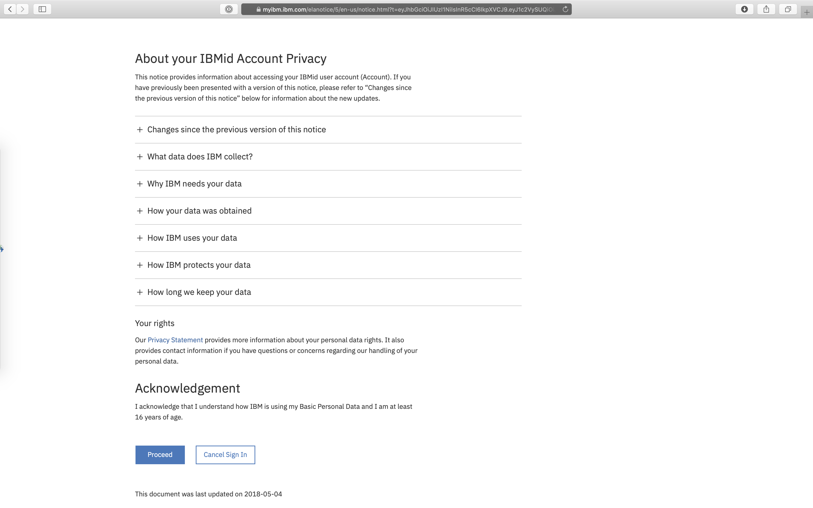
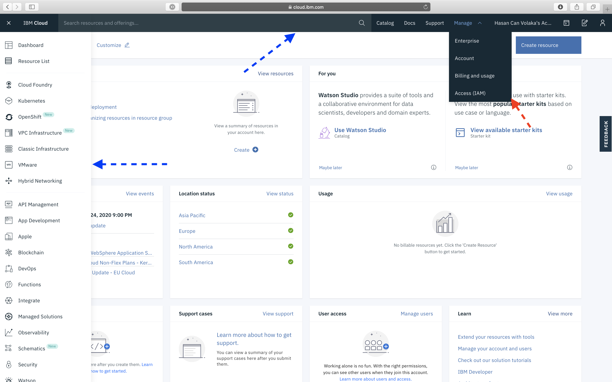

# Creating an IBM Cloud Account

If you didn’t create your IBM Cloud account before the workshop, follow this section to create it.


More detailed information and guide can be found at [IBM Cloud Docs - Signing Up for IBM Cloud](https://cloud.ibm.com/docs/account?topic=account-signup).


## Registration Process

To create an IBM Cloud Account, go to the link that your workshop host provides you. For example **ibm.biz/xxx \(**Or go to default [Registration Page](https://cloud.ibm.com/registration)**\)**

You will see a page like below. Enter the necesseary informations to create your account. 

After you click **Create Account**, you will receive a verification mail to activate your account.

After you click to the activation link, you will be redirected to a page that says successful verification. And there will be a **Log In** button. Click that button to log in to your account.

After you logged in to your account, you will see the privacy page. After examining the privacy rules, scroll down to the end of page to agree privacy policy to and proceed IBM Cloud dashboard. 

Congratulations! You have created an IBM Cloud account!

## Dashboard 

After logging in to your new IBM Cloud account, you will see a **Dashboard**.

On top left corner, you can find a navigation menu which can lead you to any service page.

On top, you can find a menu bar which includes:

* **search bar**,
* **catalog link**,
* **documentation link**,
* **support page link**,
* a dropdown to **manage your account**,
* your **accounts list**,
* **web terminal**,
* **cost estimator**,
* **notifications button** and
* your **profile button**.

When you look to the center of the page, you will see various widgets which you can configure. Default template provides you the most used informations from maintenance to usage.

## Setting up Your Profile

In your IBM Cloud™ profile, you can add a photo and personal information, manage notifications, and monitor your privacy. Setting it up helps your teammates know who you are and how you can help.


You can find more information at [IBM Cloud Docs - Setting up your profile](https://cloud.ibm.com/docs/account?topic=account-usersettings) page.


## Troubleshooting


If something happens at registration process, you can visit the [IBM Cloud Docs - Troubleshooting for accessing IBM Cloud](https://cloud.ibm.com/docs/account?topic=account-accessing) page.


